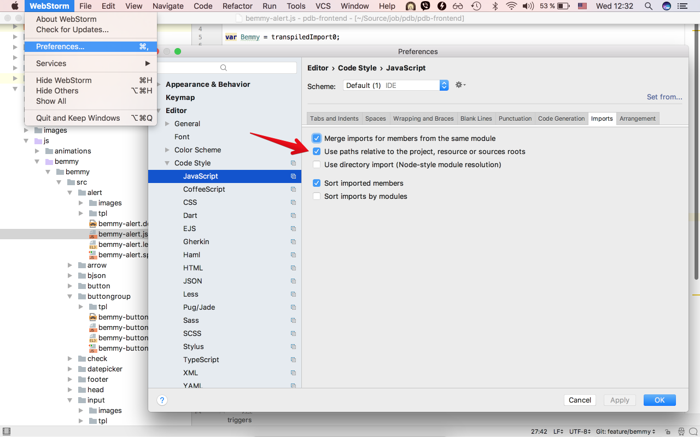

You can force WebStorm to autoimport from resources roots rather than using relative paths.



This creates:
```js
import {Prototype} from 'decorators/Prototype';
```
instead of

```js
import {Prototype} from '../../../decorators/Prototype';
```
