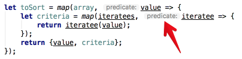

WebStorm support for TypeScript becomes better every release. Now it automatically highlights parameter names of any typed function. This feature is called [parameter hints](https://goo.gl/4YBsCu) and it is damn cool:

