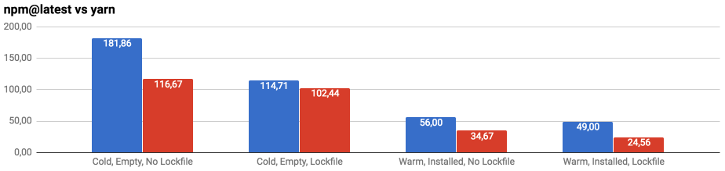

You might have heard about the [release of npm@5](http://blog.npmjs.org/post/161081169345/v500) this may.

The question is: should we move back to `npm` from `yarn`?

*tldr; it depends, most likely no.*

### How to install

```bash
npm i -g npm@latest
```

### Comparison

Comparison is taken from the  [`npm-vs-yarn`](https://github.com/thomaschaaf/npm-vs-yarn) project. For the sake of justice I've run a similar benchmark and the results were pretty much the same.




### Conlusion

It's not hard to notice `npm` and `yarn` have almost identical performance when they work without cache & with lockfile. That means you would probably like to choose `npm` as a package installer when dealing with cloud build machines (e.g. travis), because you would not need to install yarn additionally before a build process.
However, you could build a `node` artifact with `yarn` being bundled inside and in that case the choice is obvious.

---

Special credits to [Thomas Schaaf](https://github.com/thomaschaaf) for kindly granting permission to use all diagrams & data from his project [`npm-vs-yarn`](https://github.com/thomaschaaf/npm-vs-yarn).
