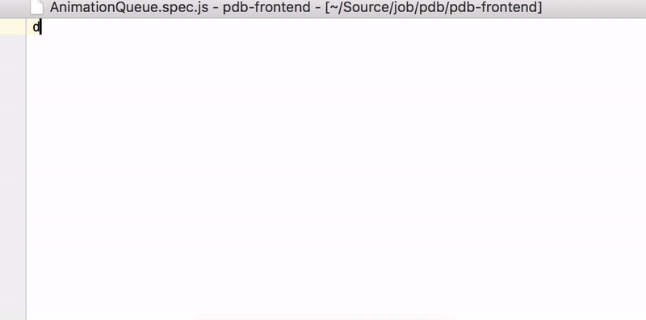
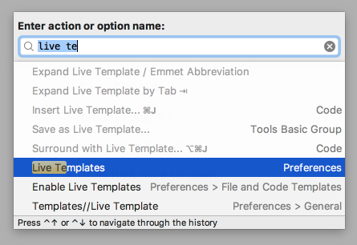
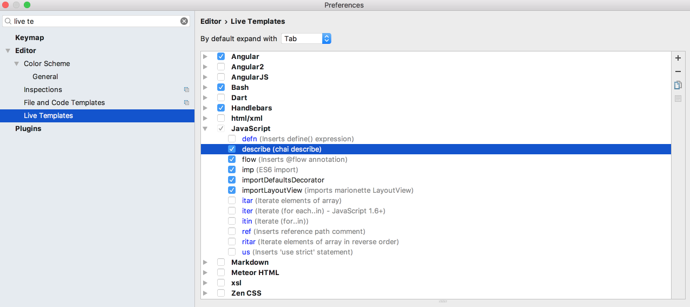
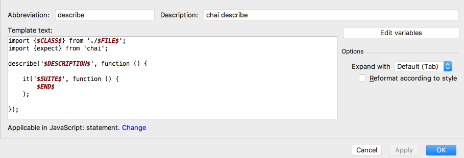
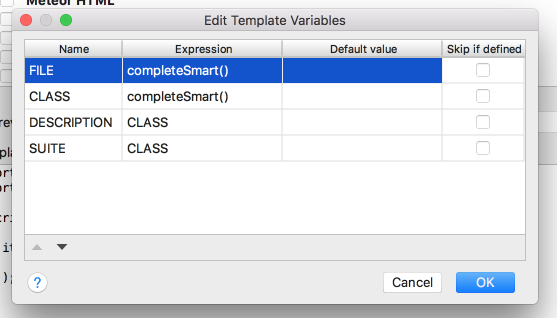
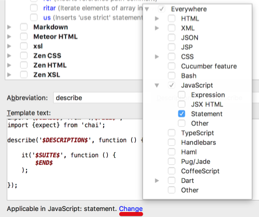

Today we will learn how to create a smart WebStorm Live Template:



As an example we will create a template for unit tests `describe` method.

### Step 1

Press `cmd(ctrl)` + `shift` + `a` to open an action menu. Type and choose **Live Templates**.



### Step 2

Open the `Javascript` dropdown and click `plus` icon at the right side of the panel.



### Step 3

**Fill up the suggested form:**

```js

import {$CLASS$} from './$FILE$';
import {expect} from 'chai';

describe('$DESCRIPTION$', function () {

    it('$SUITE$', function () {
        $END$
    );

});
```



- **Abbrevation** - the keyword which you will use to find your template during autocomplete
- **Description** - a few words which will help you distinct the template
- **[Template text](https://www.jetbrains.com/help/webstorm/live-templates-2.html)** - the code snippet. `$END$` and `$SELECTION$` are keywords, all other `$<NAME>$` are variables.

### Step 4 (the key)

Fill up the **Edit variables** form. Here are some gotchas before doing this:

- [You can change the order of variables](https://twitter.com/jamesakwuh/status/814377069194907648) which will affect the order of completing them during live template insertion
- You can refer to already defined variables in **expression** field which will work as a smart default
- There are a bit more available predefined functions than described in the [official doc](https://www.jetbrains.com/help/webstorm/live-templates-2.html)



### Step 5

Choose applicable contexts for the created live template.




Here we go! To use a template simply start typing the keyword and you will see the live template. The smart one!
