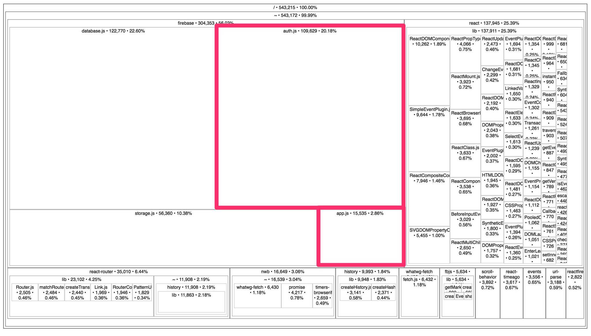

To analyze a bundle contents built w/ webpack you don't even need a webpack `stats` json. [source-map-explorer](https://www.npmjs.com/package/source-map-explorer) is here to help you:

```bash
yarn global add source-map-explorer

source-map-explorer dist/client/index.bundle.js # w/ inline sourcemaps
source-map-explorer dist/client/index.bundle.js.map # w/ generated sourcemaps
```

This will open [the following window][1]:

[][1]

As you could notice from above, the only thing you need is sourcemaps, which are enabled with [`devtool` option](https://webpack.js.org/configuration/devtool/) inside webpack config.


[1]: https://twitter.com/addyosmani/status/801834908578553856/photo/1?ref_src=twsrc%5Etfw&ref_url=https%3A%2F%2Fmedium.com%2Fmedia%2Fa4215e200110bc61e34063d539df0f83%3FpostId%3D41096559beca
