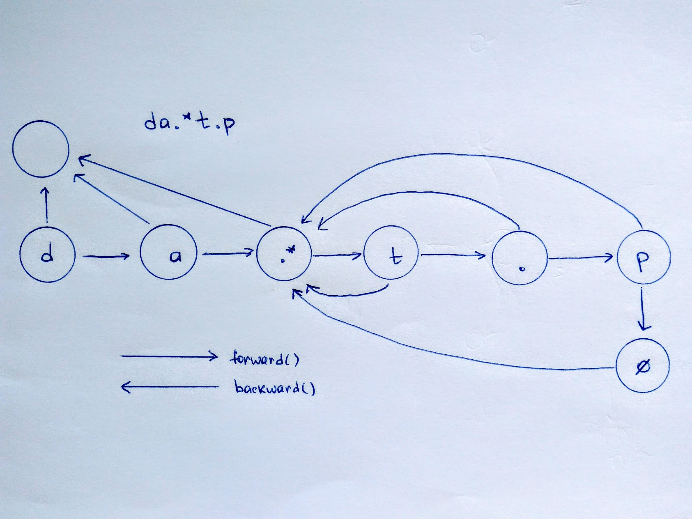

Today we will implement our own regular expressions matcher using a FSM (Finite State Machine) model. We will support `.` and `*` special characters:

`a*` - matches 0+ consecutive `a` symbols  
`.` - matches 1 any symbol

Often a good picture is a half of solution. Let's visualize a FSM for the RegExp `da.*t.p` (which will match `dailytip` as you see).



Arrows show us possible ways of moving during matching process. To understand the idea better lets match the string `dart` against `da.*t`.

*[Imagine you are a FSM]*

1. Set current step to **(d)** and current letter to **d**
2. Current step matches current letter -> set current step to **(a)** and current letter to **a** (*move forward*)
3. Current step matches current letter -> set current step to **(.*)** and current letter to **r** (*move forward*)
4. The initial counter of any wild(asterisk) step is `0`. Hence, simply set current step to **(t)** (*move forward*)
5. Current step **(t)** doesn't match current letter **r** -> go back to step **(.*)**, increase its counter to `1` and set current letter to **r** (*move backward*)
6. Current step **(.*)** with counter `1` matches current letter **r** -> set current step to **(t)** and current letter to **t** (*move forward*)
7. Current step **(t)** matches current letter **t** -> set current step to **``** (final step) and current letter to **``** (end of a string).
8. Current step is final and current letter is also end of a string. Hence, we succeed. Stop the machine and answer `true`

The described process represents a greedy algorithm (an algorithm which chooses best local solutions hoping they will bring the best global solution) with rollbacks and lazy behavior of wild steps.

Our next task is to describe all needed steps which our FSM uses. These are:

##### NullStep

<details>
    <summary>Source</summary>
    <p>

```js
class NullStep {

    inc() {
    }

    /**
     * Calling this method means there is no possible match (regardless of WildSteps internal state)
     * If so, there is no match
     */
    match(state) {
        state.status = STATE_FAILED;
    }

    reset() {
    }

}
```
</p>
</details>

This is a failing wild step. Once a state machine reached this step, it switches its internal status to `failed` meaning there are no possible ways to match a string regardless of wild steps internal state)

##### FinalStep

<details>
    <summary>Source</summary>
    <p>

```js
class FinalStep {

    match(state) {
        if (state.cursor === state.length) {
            // if there are no more symbols to match then it is a success
            state.status = STATE_SUCCEED;
        } else {
            // otherwise move backward to try other WildSteps internal state combinations
            state.backward();
        }
    }

}
```
</p>
</details>

This is the final step. If cursor points to the end of a string then FSM status switches to `succeed`. Otherwise it executes a `backward` operation, failing back to the last wild step to try to change its internal state and match again.

##### Step

The step matching exactly 1 symbol. If it matches the current cursor letter then it executes a `next` operation, incrementing cursor and current step. Otherwise it executes a `backward` operation, failing back to the last wild step to try to change its internal state and match again.


<details>
    <summary>Source</summary>
    <p>

```js
class Step {

    constructor(symbol, index) {
        this.counter = 1;
        this.symbol = symbol;
        this.index = index;
    }

    matches(symbols) {
        return this.symbol === ANY_SYMBOL
            ? symbols.length === this.counter
            : symbols === this.symbol.repeat(this.counter);
    }

    match(state) {
        let symbol = state.string.slice(state.cursor, state.cursor + this.counter);

        if (this.matches(symbol)) {
            state.cursor += this.counter;
            state.forward();
        } else {
            state.backward();
        }
    }

}
```
</p>
</details>

##### WildStep

Same as `Step` except it matches 0+ symbols and can be used for fallbacks (a `backward` operation).


<details>
    <summary>Source</summary>
    <p>

```js
class WildStep extends Step {

    constructor(symbol, index, previousWildStep) {
        super(symbol, index);
        // a .counter is an internal state variable which defines
        // how match symbols a step should match
        this.counter = 0;
        this.previousWildStep = previousWildStep;
    }

    reset() {
        this.counter = 0;
        this.previousWildStep.reset();
    }

    match(state) {
        let symbols = state.string.slice(state.cursor, state.cursor + this.counter);

        if (this.matches(symbols)) {
            this.lastCursor = state.cursor;
            state.lastWildStep = this;
            state.cursor += this.counter;

            state.forward();
        } else {
            this.counter = 0;
            state.lastWildStep = this.previousWildStep;
            state.backward();
        }
    }

    inc(state) {
        // move the state machine cursor to the last saved position
        // while matching a current step
        state.cursor = this.lastCursor;
        this.counter++;
    }

}
```
</p>
</details>

<br>

That's it. The remaining is simple: parse a RegExp and build a steps array from it and iterate unless internal state machine status becomes one of final (`failed` or `succeed`).

<details>
    <summary>Source</summary>
    <p>

```js
class StateMachine {

    constructor(regexp) {
        this.steps = [];
        this.nullStep = new NullStep();

        let letters = regexp.split(''),
            /**
             * WildStep is the step for (c*) group. We are treating them in a special way
             * because these steps are subjects to fallback
             */
            lastWildStep = this.nullStep;

        for (let i = 0; i < letters.length; ++i) {
            let currentSymbol = letters[i],
                nextSymbol = letters[i + 1];

            if (nextSymbol === ANY_COUNT) {
                // skip the asterisk
                ++i;
                // (a*a*) is equal to (a*)
                if (lastWildStep !== last(this.steps) || currentSymbol !== lastWildStep.symbol) {
                    lastWildStep = new WildStep(currentSymbol, this.steps.length, lastWildStep);
                    this.steps.push(lastWildStep);
                }
            } else {
                this.steps.push(new Step(currentSymbol, this.steps.length));
            }
        }

        this.steps.push(new FinalStep());
    }

    match(string) {
        this.cursor = 0;
        this.string = string;
        this.length = string.length;
        this.lastWildStep = this.nullStep;
        this.status = undefined;
        this.currentStep = this.steps[0];

        while (!this.status) {
            // switch machine state unless it becomes one of final states (failed || succeed)
            this.currentStep.match(this);
        }

        this.lastWildStep.reset();

        return this.status === STATE_SUCCEED;
    }

    /**
     * Move forward to the next step
     */
    forward() {
        this.currentStep = this.steps[this.currentStep.index + 1];
    }

    /**
     * Move backward to the changeable step. In other words move to
     * the last WildStep and try to increment its match count, which
     * could lead a string to match a pattern
     */
    backward() {
        // increment the internal state of a last wild step
        this.lastWildStep.inc(this);
        // and try to match again
        this.currentStep = this.lastWildStep;
    }

}
```
</p>
</details>

---

#### Conclusion

FSM is a pretty well visualizable and extensible model for building RegExp matchers. However it has a limited scope of applications, which we will try to define in a future daily tips.  
BTW we've solved a [`hard` task on leetcode][1].

#### Q & A

> This task has an elegant and short recursive/DP solution.

Yes. Try support a few more special symbols like `?`, `?=`, `?<` and DP solution will not be as elegant as you want it to be (if any). FSM will only need some additional `Step` classes.

> I heard a FSM must read a tape from left to right only. I mean `backward` operation makes it a Turing Machine, not FSM. Isn't it?

I heard the same too. And also I heard a FSM could accept any regular language. Currently I came to some misunderstanding in terminology. I definitely will find out the answer and post it in a future daily tip.

[1]: https://leetcode.com/problems/regular-expression-matching/description/
