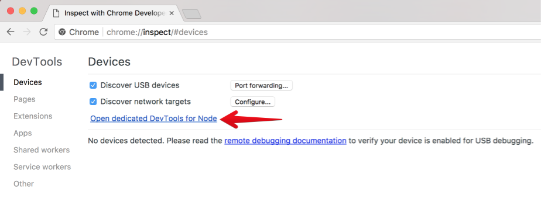
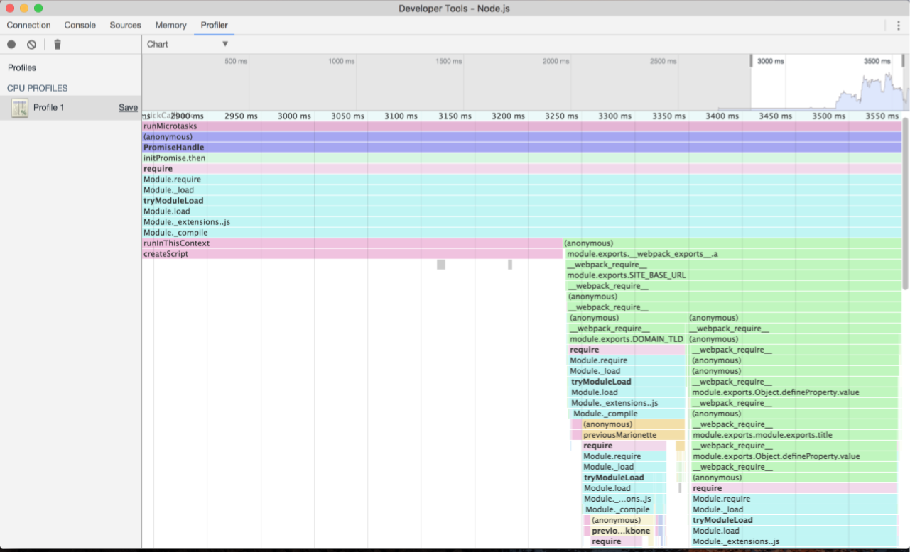

With Chrome 60 / Canary debugging Node became easier:

1.&nbsp;Go to `chrome://inspect`  
2.&nbsp;Click **Open dedicated DevTools for Node**



Now you could leave the opened window for a long time. Each time you will run node w/ `--inspect` flag the opened DevTools will automatically connect to the process.

3.&nbsp;Run your app w/ `--inspect --debug-brk` flags:

```js
node --inspect --debug-brk index.js
```


