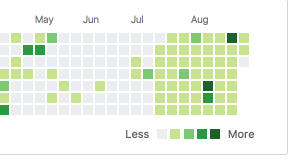

This is the **50th** tip (what is quite good!) so I have decided to devote it to describing what is going on behind the `dailytip` project.

Some of you have asked me about my goals and expectations for the project. Let me shed some light on the goals.

#### Form the character (e.v.e.r.y. d.a.m.n. d.a.y.)

*(Me writing dailytip in Uber on the way home)*

Usually a man counts places where he had a sex with his paramour: home, local park, car backseat, forest, swimming pool. I count places where I have written dailytip. Just to name a few: home, office, airport, swimming pool, car backseat, Airbnb accommodation, outdoors.

That is, I definitely start planning my schedule in a better way. What is quite important for me as I am constantly trying to find the most optimal work-life-projects balance.

#### Learn English

I am not going to explain the importance of English (or as they say in math evidences: let English be an important language by definition). Writing `dailytip` as you might guess helps me to improve a bit the way I write and read in English. This would not be possible without help of my beloved [girlfriend][1].

#### Force myself to get a new knowledge everyday

Such a project is a perfect motivation to learn new things constantly. When you have started it, you cannot post the same things again and again. You are forced to read news, learn technologies, explore and write libraries, solve algorithmic tasks and much much more. Moreover, it shows you the lack of experience in a specific area, what in turn forces you to learn even more.

#### Help / mentor people

At the moment I am writing this tip there are 120 telegram subscribers in our [channel][2]. Once I have more time I will start to work on increasing channel subscribers. Seeing your channel grows (slow or fast, it doesn't matter too much at the beginning) is quite motivating. People finding bugs/typos in your posts or saying *Thank you* are even more motivating.

#### Open source & a beautiful GH history 😊

  
*(My github contribution timeline. Beautiful, isn't it?)*

---

I hope you enjoy the `dailytip` project. Don't hesitate to contact me to leave a feedback at any time via [Telegram](https://t.me/jakwuh) or [email](mailto:jakwuh@gmail.com).

[1]: https://www.instagram.com/marina_amani_/
[2]: https://t.me/webtip
