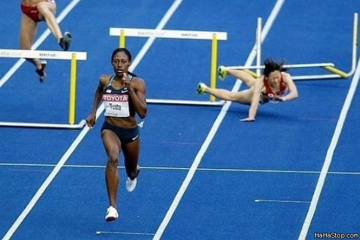

tldr; The result of `Promise.race(promises)` is the first finished promise, regardless of it being resolved or rejected.

---

While using `Promise.race` remember not to draw an analogy with an ordinary race. Usually although a participant has fallen during a race other participants continue to run. This is not the case for `Promise.race` as it is rejected as soon as one of its promises is rejected.



The following pieces of code are equal and help understand `Promise.race` better.

```js
return new Promise((resolve, reject) => {
    makePromiseCall().then(resolve, reject);

    setTimeout(reject, timeout);
});
```


```js
return Promise.race([
    makePromiseCall(),
    new Promise((resolve, reject) => setTimeout(reject, timeout))
]);
```

|makePromiseCall|setTimeout|Promise.race|
|-|-|-|
|resolved||resolved|
|rejected||rejected|
||resolved|resolved|
||rejected|rejected|
