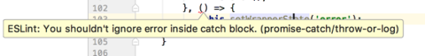
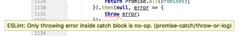
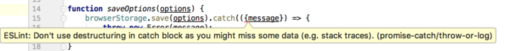
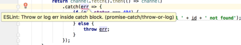
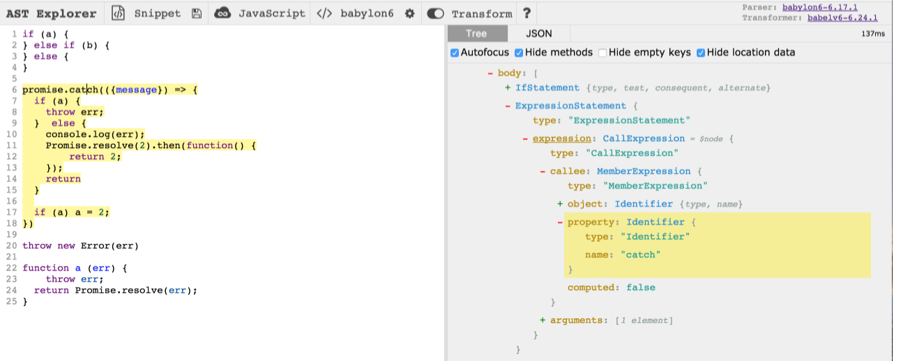

#### Subscribe to our [Telegram channel](https://t.me/dailytip) to get daily updates  

---

Today we will learn how to write a custom eslint plugin + rule.

##### Links:
- [Final code][4]
- [Why eslint is important? - It empowers you as a team lead.][1] By [Jamund Ferguson][2] @ [EmpireJS 2016][3], NYC

### Introduction

You'll probably be surprised (like me) if I say you eslint uses [espree][5] (a fork of [esprima][6]) for parsing and traversing JS ASTs. There is no telling this is a surprising fact too much, as far as esprima is pretty popular, but that leads to a much promising conclusion: writing eslint plugins should not be far off writing babel plugins (what I've [already done][7] earlier). More to the point, lets begin.

### Step 1

The first thing we need is a [`yeoman` generator for eslint][8].

```bash
yarn global add yo
yarn global add generator-eslint
```

### Step 2

As you might guess, we will use the downloded generator to create a boilerplate code for our new eslint plugin. That was the first time for me using generator for such a purpose and it was awesome! A few minutes for answering simple questions and here I am writing a plugin code, not dealing with a boring boilerplate stuff. Definitely you should give `yeoman` a try.

```bash
yo eslint:plugin # boilerplate for plugin
yo eslint:rule # boilerplate for rule
```

### Step 3

Once we scaffolded code it's time to write a plugin. We will create a plugin which will force developers to properly deal with errors inside catch block: either log them or throw downside. For the last time I've learned a lot about logging (unfortunately, learning from my own mistakes) but now I know logging is a must.

##### This is what it looks like:



<br/>



<br/>



<br>



### Step 4

Our next step will be to learn more about JS AST. The most common tool for doing this is [astexplorer][9]. We will need to check all `.catch` & `.then` promise blocks. Our assumption is the following: if there is an expression on which `.catch` or `.then` are called then we assume this is a promise call and check the appropriate block. To understand how to find expression calls we will use astexplorer.



So... `CallExpression` seems exactly like what we are looking for. Then our entry point will be CallExpression.

```js
return {
    CallExpression: function (node) {
        // ... plugin code
    }
}
```

> Here I am intentionally skipping the basics of traversing ASTs w/ parsers like esprima. For those who are doing this for the first time I highly recommend reading [babel plugin handbook][10]

### Step 5

Technically, there is only one step left: validate an AST and report if there are any lint errors. This is the most interesting part which we will cover in the next tip.

Keep your eyes open, we'll continue soon!

[1]: https://www.youtube.com/watch?v=zgumHANVlxo
[2]: https://github.com/xjamundx
[3]: http://2016.empirejs.org/
[4]: https://github.com/jakwuh/eslint-plugin-promise-catch
[5]: https://github.com/eslint/espree
[6]: http://esprima.org/
[7]: https://github.com/jakwuh/babel-plugin-extract-dependency-definitions
[8]: https://npmjs.com/package/generator-eslint
[9]: https://astexplorer.net/
[10]: https://github.com/thejameskyle/babel-handbook/blob/master/translations/en/plugin-handbook.md
