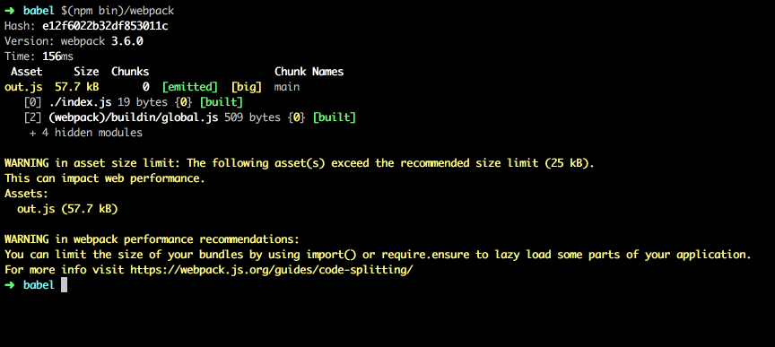

In the last [Totally Tooling Tips episode][1] Addy Osmani & Matt Gaunt show a few interesting tools for managing bundle size. This is a short overview of them:

#### [bundlesize][2]

[bundlesize][2] is a package which could be seamlessly integrated with Github. It helps you track that bundle sizes are not exceed their max sizes. The configuration looks like the following:

```js
// package.json
{
  ...
  "scripts": {
    "test": "bundlesize"
  },
  "bundlesize": [
    {
      "path": "./index.js",
      "maxSize": "1 kB"
    }
  ]
}
```

And the output:

```
> npm test
PASS  index.js: 53B < maxSize 1KB gzip
```

As you could see `bundlesize` works with gzip sizes out of the box.

#### Webpack performance budgets

[Starting from][3] `webpack@2.2` you can use webpack performance budgets:

```js
// webpack.config.js
performance: {
  maxAssetSize: 25000,
  hints: 'warning'
}
```



#### [Speedcurve][4] and [Calibre][5]

These are paid services which measure a lot of metrics on a regular basis.

[1]: https://youtu.be/Da6VxdGU2Ig
[2]: https://github.com/siddharthkp/bundlesize
[3]: https://medium.com/webpack/webpack-performance-budgets-13d4880fbf6d
[4]: https://speedcurve.com/
[5]: https://calibreapp.com/
