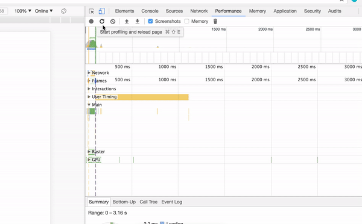

[Performance][1] API has two useful methods: `.mark()`
 and `.measure()`.  



`performance.mark(name)` - adds a new performance entry

`performance.measure(name, startMark, endMark)` - measures time between two given performance entries, identified by a mark name.

The most interesting part here is that `performance.measure()` adds a new event into the **User Timing** section under the **Performance** tab. (checked in Chrome 60 / Canary). This could be very useful to build a general picture of an execution flow.

<details>
<summary>Source code</summary>
<p>  
```js
function asyncOperation() {
    setTimeout(() => {
        performance.mark('async-done');
        performance.measure('time-to-async', 'async-start', 'async-done');
    }, 1000);
}

performance.mark('async-start');
asyncOperation();
```
</p>
</details>

[1]: https://developer.mozilla.org/en/docs/Web/API/Performance
