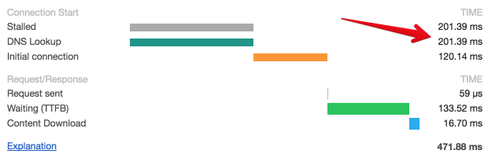

Resource hint is a way of prematurely giving resource information to a browser to make it faster: whether it is looking up for a domain or fetching a script. Lets explore existing resource hints and their purpose.

#### dns-prefetch

```html
<link rel="dns-prefetch" href="//murmle.com/">
```

The link is used to force the lookup for a specific domain. This can be used to reduce DNS lookup time. BTW, here we understand why CDN is better for a user: usually CDN's domain is already resolved and cached in a browser thus DNS lookup time will be 0.



#### preconnect

```html
<link rel="preconnect" href="//domain-name.com">
```

`preconnect` is even more powerful technique - it initiates an early TCP connection to a domain, which includes DNS lookup and TCP \ TLS negotiations (e.g. handshakes).

#### preload

```html
<link rel="preload" href="/script.js" as="script">
```

The resource hint is used to identify a resource that is likely to be required on a current page. If used for scripts, browser only loads a resource and do not executes it.

#### prefetch


```html
<link rel="prefetch" href="/script.js" as="script">
```

This is similar to `preload` resource hint, but is used to identify a resource that is likely to be required on future pages. This means a resource will have a lower priority in a download queue.

#### prerender

```html
<link rel="prerender" href="//domain.com/welcome.html">
```

The last (but not the least) resource hint, `prerender`, is used to identify a page that might be required by the next navigation.
