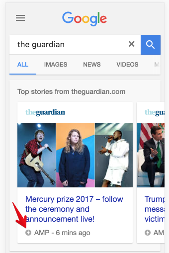

For a long time I had no idea what [Accelerated Mobile Pages (AMP)][1] actually is, when it should be used and how one could benefit from it. Today I decided to find it out.

To cut a long story short, [AMP][1] is a Google alternative to Telegram's *InstantView*, Facebook's *Instant Articles*, Yandex's *Turbo Pages* and Apple's *News* just to name a few. It allows to open pages "instantly" at Google search results and a few partners (e.g. Twitter AFAIK).

#### What are AMP requirements?

[There are a lot][2]:

- Author-written / 3rd party JS is allowed **only in iframes having different domain** (for security reasons). This means an AMP page itself will work without JS at all
- All JS scripts must be asynchronous
- All static content should have their sizes defined in a markup
- All CSS must be **inlined**
- Animations are forbidden except those which run on a GPU (basically `transform` and `opacity` properties)
- ... (a few more)

#### Is it possible to invalidate cache?

Yes.

Less than a year ago AMP introduced `update-ping` API for invalidating cache. Currently [AMP says][4] the API will eventually be deprecated, instead `update-cache` API is available. Such an unstable API also shows AMP is still in an infantile stage.

#### Could I have both AMP and non-AMP versions?

Yes.

Actually you could serve it in [a number of ways][6]: by using prefix (e.g. `example.com/amp`), by using a subdomain (e.g. `amp.example.com`) or even by using a different domain (`amp-example.com`).

#### Is it still alive?

Yes. More so, I'd say it is *still an unstable technology*.

#### Will I benefit from it?

From what I learned if your service:

- is read-only in most cases (e.g. news website)
- has a large mobile audience
- has a lot of Google traffic

you will probably benefit from having AMP version **along** with the usual one.

Reading further:  
[A story about switching to AMP][5]  
[Short AMP overview][8]  
[Big AMP overview][7]

[1]: https://www.ampproject.org/
[2]: https://www.ampproject.org/learn/about-how/
[3]: https://github.com/ampproject/amphtml/issues/1901
[4]: https://developers.google.com/amp/cache/update-cache
[5]: https://evertpot.com/switching-to-amp-and-back-again/
[6]: http://www.thesempost.com/websites-can-serve-amp-pages-on-subdomain-or-different-domain/
[7]: https://www.copyblogger.com/google-amp/
[8]: https://css-tricks.com/taking-amp-for-a-spin/
