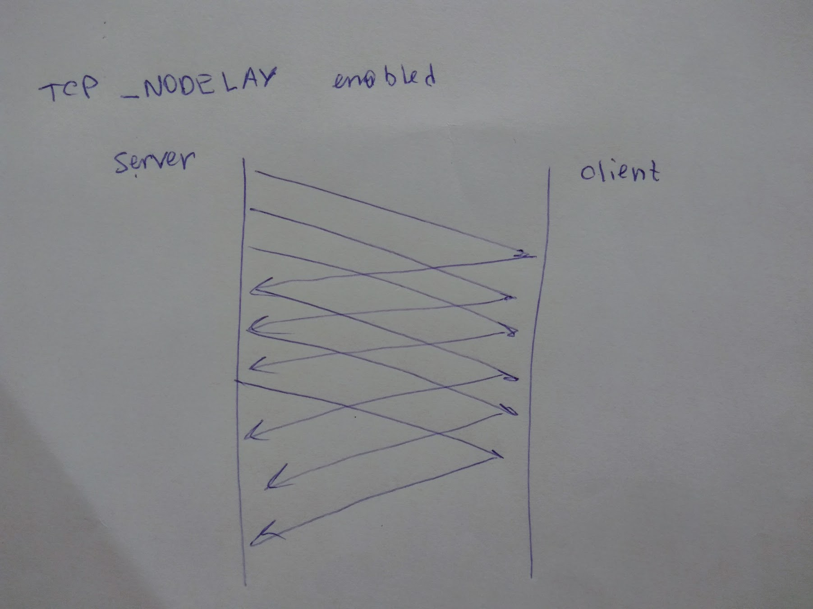

Today I learned about a very handy option `TCP_NODELAY` that changes the way TCP sends the data. To understand what it actually does we need to learn two new tcp-related abbreviations:

[**MSS**][6] - maximum segment size, the maximum amount of data that could be sent in a single TCP segment
[**ACK**][7] - acknowledgement, the signal client sends to the  server to signify a package receipt

At the initial implementation TCP sent data immediately. Thus, if on a server you emitted small chunks of data then TCP did not buffer them but simply sent to a client. This resulted into tinygrams (aka small packets) going over network and creating unfairly congestion. John Nagle created an [algorithm][1] which eliminates the described problem. It works as following:

- If there is no unconfirmed data then send a new packet immediately
- If there is an uncomfirmed data then wait for ACK and meantime buffer new chunks of data until its size exceed MSS

It's actually easier to demonstrate the difference with drawings:


*TCP_NODELAY = false*


*TCP_NODELAY = true*

### Step 1. Networking

First of all we need to simulate real network conditions at the loopback interface (aka localhost). To do this, we will use `dnctl` and `pfctl` control tools.

Assume a server listening port will be `1995`:

```bash
(cat /etc/pf.conf && echo "dummynet-anchor \"mop\"" && echo "anchor \"mop\"") | sudo pfctl -f -
echo "dummynet in quick proto tcp from any to any port 1995 pipe 1" | sudo pfctl -a mop -f -
sudo dnctl pipe 1 config delay 500
```

The command above will create a pipe which delays all pass-through traffic by 500ms (round-trip will be delayed by 1000ms) and pass any tcp traffic going to port `1995` over it.

You can check traffic is actually delayed by creating a `SimpleHTTPServer` and making a request to it:

```bash
> python -m SimpleHTTPServer 1995 &
[1] 37087
> sudo dnctl pipe 1 config delay 0
> time curl -so /dev/null localhost:1995
# ...
0.00s user 0.00s system 45% cpu 0.015 total
> sudo dnctl pipe 1 config delay 500
> time curl -so /dev/null localhost:1995
# ...
0.00s user 0.01s system 1% cpu 1.231 total
> kill 37087
```

Now its time to [log tcp packets][4] and see what's happening with the network:

```bash
> tcpdump -D
# ...
9.lo0 [Up, Running, Loopback] # `lo0` is the name of loopback interface

> tcpdump -i lo0 dst port 1995 # log all packets on that interface on a given port
```

### Step 2. Client and server

Our client code will do nothing special rather than connecting to a given interface and port and receiving data.

```js
// client.mjs
import net from 'net';

let client = new net.Socket();
let port = process.env.PORT;

client.connect(port, '127.0.0.1', () => {
	console.log('Connected');
});

client.on('data', data => {
	console.log(Date.now());
	console.log(`Received: ${data}`);
});

client.on('close', () => {
	console.log('Connection closed');
});
```

Server code will make use of [`socket.setNoDelay(:boolean:)`][5] function which enables/disables Nagle's algorithm.

```js
// server.mjs
import net from 'net';

let port = process.env.PORT;
let noDelay = Boolean(process.env.TCP_NODELAY);

let server = net.createServer(socket => {
	socket.setNoDelay(noDelay);
	for (let i = 0; i < 10; i++)
		socket.write('' + i);
});

server.listen(port, '127.0.0.1', () => {
	console.log('Server is running...');
});
```

### Step 3. `tcpdump` with `TCP_NODELAY = false` (NodeJS `net`'s default)

```bash
nvm use 8.5.0
PORT=1995 node --experimental-modules ./server.mjs &
PORT=1995 node --experimental-modules ./client.mjs
```

[`tcpdump` output][8]

client output:
```
Connected
1505503744264
Received: 0
1505503744764 # time delay between two messages is 500ms
Received: 123456789
```

### Step 4. `tcpdump` with `TCP_NODELAY = true`

```bash
PORT=1995 TCP_NODELAY=1 node --experimental-modules ./server.mjs &
PORT=1995 node --experimental-modules ./client.mjs
```

[`tcpdump` output][8]

client output:
```
Connected
1505505632466
Received: 0
1505505632467 # time delay between two messages is 1ms
Received: 123456789
```

### Conclusion

As you have seen `TCP_NODELAY` option may result into a huge difference when dealing with a small chunks of data (an ordinary case of using web sockets). Next time you will use sockets read [an in-depth overview][2] and make a right decision on a `TCP_NODELAY`.

### Links & resources
[Nagle's algorithm][1]  
[An in-depth overview of TCP_NODELAY][2]  
[*nix Networking CheatSheet (limiting bandwidth, adding delays)][3]

[1]: https://en.wikipedia.org/wiki/Nagle%27s_algorithm
[2]: https://www.extrahop.com/company/blog/2016/tcp-nodelay-nagle-quickack-best-practices/
[3]: https://gist.github.com/mefellows/4f6ecd2e83de8b591726
[4]: https://akwuh.me/t/8/
[5]: https://nodejs.org/api/net.html#net_socket_setnodelay_nodelay
[6]: https://en.wikipedia.org/wiki/Maximum_segment_size
[7]: https://en.wikipedia.org/wiki/Acknowledgement_(data_networks)
[8]: https://gist.github.com/jakwuh/a282abccf0ba0025ccb7f8c2f47d08fd