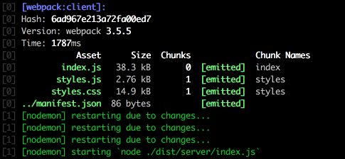

When creating small or medium sized repositories, I prefer using ordinary npm scripts to *`gulp`/`grunt`/`<other build system>`* tasks (to avoid unreasonable complexity and dependencies). There is an understandable need of running a few scripts in parallel: the same as `gulp.parallel` does (e.g. running `webpack -w` and *node.js server* listening on a specific port). Today I have learned a very convenient way of doing this: using [`concurrently`][1] library.

```json
"scripts": {
   "webpack:watch": "node ./build/webpack --development --watch",
   "serve:watch": "nodemon ./dist/server/index.js",
   "start": "concurrently --kill-others \"npm run webpack:watch\" \"npm run serve:watch\""
 }
```

Now with `npm start` there are 2 concurrently running processes, both prefixed with its own appropriate prefix:



Still, keep in mind that on a UNIX based machines you could achieve the similar result without any 3rd party tools by just using a **pipe** operator:

```json
"start": "npm run webpack:watch | npm run serve:watch
```

[1]: https://www.npmjs.com/package/concurrently
