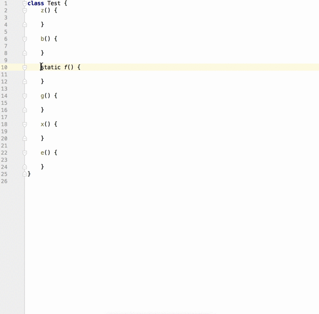
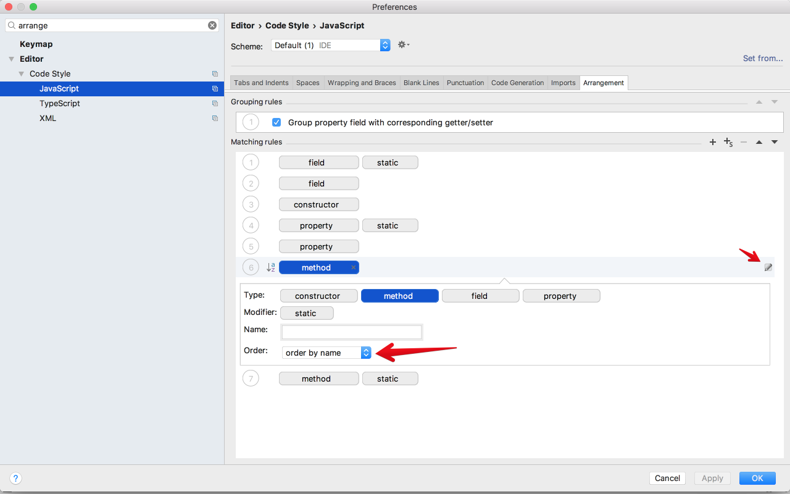

In [the previous tip][1] we have mentioned a rule from [Angular Style Guide][2]:

- Do place private members after public members, **alphabetized**.

WebStorm (as well as other JetBrains IDEA's) has an automatic code arrangement feature. Look at the demo:

To start using it you need to do a few simple steps:

1) Set up the **Arrangement** settings as shown at the screenshot below

2) Press `cmd (ctrl)` + `shift` + `a` and choose **Rearrange Code**

[1]: https://github.com/jakwuh/dailytip/tree/master/tips/19-09-2017
[2]: https://angular.io/guide/styleguide
