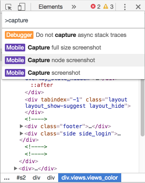

Chrome 62 introduces a lot of useful features. The full list is available at [developers.google.com][1]. Some of the most interesting from my point of view:

- Top-level `await`:

```js
await fetch('https://akwuh.me/t/1') // returns Response
(await fetch('https://akwuh.me/t/1')).text() // returns string
```

- An API for searching for all instances of a specific constructor (!).

```js
queryObjects(Promise) // returns an array of all instantiated promises
```

We should definitely think about approach to easily find memory leaks by using `queryObjects`.

- Screenshots of a specific HTML node (which is broken if there is a horizontal scrollbar at the page though)

To use it press `cmd(ctrl) + shift + p` and type `capture`.



[1]: https://developers.google.com/web/updates/2017/08/devtools-release-notes
