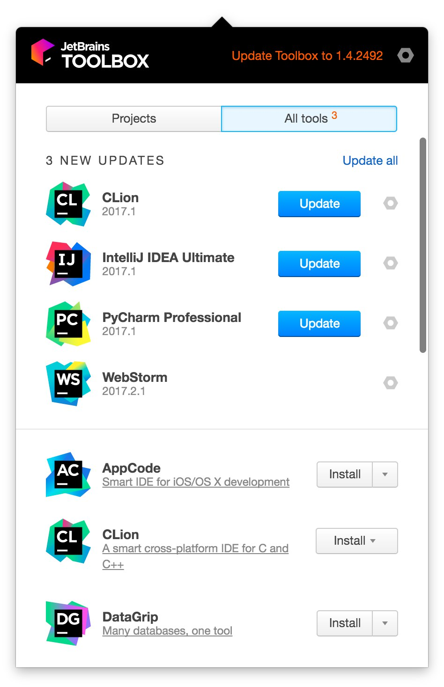

A software digest made by developers in 2 parts.  

**Part 1/2**: code editors.

Big thanks to:

- [Ivan Akulov][1]
- [Ivan Pazhitnykh][3]
- [Sergei Samsonov][5]
- [Vadim Liakhovich][4]

for the participation in the interview.

#### JetBrains

[Ivan Akulov][1] about **IntelliJ**:  
It’s an IDE created by JetBrains. I started using it when I joined EPAM because it was the most common IDE on my project, and I fell in love with it pretty quickly. It’s my primary code editor since then.

Pros:
* It’s a monolith. The most valuable advantage of this is that all the features are maintained by a team with a single vision and therefore are consistent. I like this more than an editor with a bunch of plugins where each plugin is configured in a different way, and some of them even conflict with each other.
* It supports JavaScript really well. There’s a lot of cool stuff, but the thing that still amaze me most of all is its refactoring. If you have a module with an exported method, and you rename it, it will properly find and rename all its usages in all project files. If you move a file to a different place, it will find and update all its imports – and this works almost in every case.

Cons:
* It’s slower than other editors. This is the flaw of the feature quantity. On large projects, it happens pretty often that the text cursor freezes for a second or two while you’re typing the text.
* It’s written in Java, so one can't simply write a plugin for IDEA. In VS Code e.g., on the contrary, everything could be tuned with either CSS or JavaScript.

[Ivan Pazhitnykh][3] about **[JetBrains Toolbox][6]**:  
*JetBrains Toolbox*, that I started using half a year ago, turned out to be very useful when you have a few projects at the same time. It allows you to open each of them from one place and update your IDEs in one click.



#### Sublime text

[Sergei Samsonov][5]:  
It is a simple, fast and easy tuned code editor.

[Ivan Pazhitnykh][3]:  
I use Sublime for looking through the code. It can be simple opened with:
```bash
sublime ./foo.js
```

[Vadim Liakhovich][4]:  
When I joined Yandex I was using Sublime for the first time, but quickly I switched to WebStorm. Sublime is really fast and has a lot of plugins, but that is also its disadvantage: one needs to install a bunch of them to have more or less tuned environment.

[1]: https://iamakulov.com/
[2]: https://akwuh.me/
[3]: https://github.com/drapegnik/
[4]: https://github.com/vlyahovich/
[5]: https://github.com/dontuncleme/
[6]: https://www.jetbrains.com/toolbox/

#### Visual Studio Code
It’s an advanced code editor created by Microsoft. Unlike traditional Visual Studio, it’s small, quick and free. I started using it half-a-year or a year ago when I tried to find a more modern replacement for Notepad++.

Pros:
* It’s small but has just enough features. I tend to use it to quickly edit a file or code a small project, and, in my experience, it does this job really well.
* It’s slick. I like pleasant interfaces.

Cons:
* It’s still slower than Notepad++. The latter is written in C++ so it is opened just instantly. The former is Electron and JavaScript so… you get it.
* It can’t open large files (a few megabytes). When I need to read logs, I still have to use Notepad++.

[Vadim Liakhovich][4]:  
For the last time I use VS Code apart from WebStorm because it:

- is fast enough
- has a good TypeScript support out of the box
- has a good plugins ecosystem

But it still has an important drawback - not being a fully-featured IDE.
