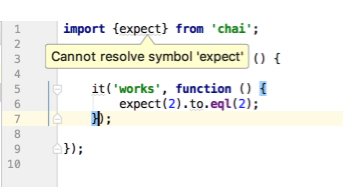
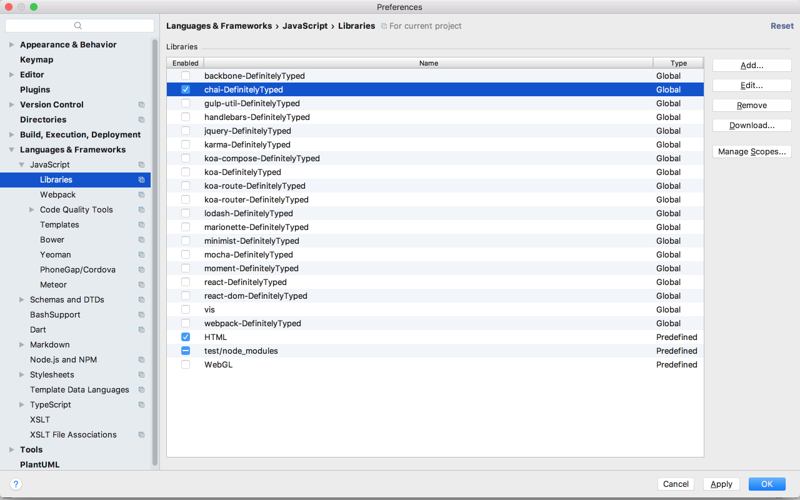
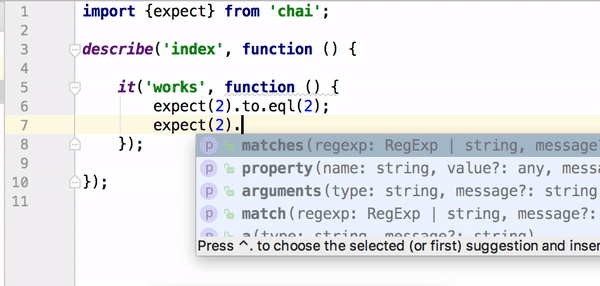

Many JavaScript libraries still exist in a **CommonJS** style. This becomes a problem when it comes to resolving library exports in order to enable proper autocomplete.



Fortunately, there is a [DefinitelyTyped](https://github.com/DefinitelyTyped/DefinitelyTyped) TypeScript project to fix this. There are two ways of enabling typings in your project.

#### 1. By using npm `@types` scope (recommended)

To make an autocomplete work in the example above we have to install 2 `@types` packages:

```
npm i @types/mocha @types/chai --save-dev
```

#### 2. By enabling typings in IDE

WebStorm gives the possibility to enable custom typings through the project preferences:



The difference between the 1st and the 2nd option is that while using `@types` npm scope you add your typings into `package.json` so all of your teammates automatically get the typings; however with the 2nd option typings are binded to a current IDE. If you work independently the 2nd option might still be a better choice because in this case you need to download them only once and they will become cached for all of your projects.

Finally, we have an autocomplete working:


