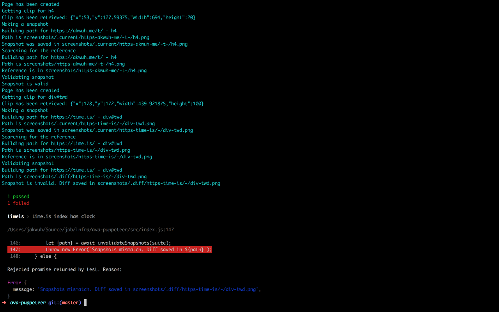

tldr;  
An [`ava-puppeteer`][3] library is available at GitHub already and will become available at `npm` soon.

> `ava` was chosen for a first-class support only for the current iteration. This library will actually work well even with `mocha`, `tape` and other test runners.

After having a small research followed to [the previous tip][1] the following API has been evolved:

```js
// bootstrap.js
const {createCapture} = require('ava-puppeteer');

global.capture = createCapture();
```

```js
// test-module-A.js
import test from 'ava';

test('Dailytip homepage has Telegram subscribe banner', async t => {
    await capture({
        url: 'https://akwuh.me/t/',
        selector: 'h4'
    });
    t.pass();
});
```

This is an example of a zero (!) config snapshot testing which is now possible thanks to [the puppeteer library][2].



### Highlights

1. `createCapture` - the exported function of the `ava-puppeteer` launches Chromium headless browser. It accepts `{root}` option which allows you to change the root directory for storing snapshots
2. `capture` function opens a new tab at Chromium, loads up a page, makes a screenshot for the provided selector, then saves it to disk and compares with the reference. It uses input parameters to identify where a screenshot should be saved.

### Workflow

Workflow of working with screenshots is literally identical of the workflow of working with [ava's snapshots][4]. Once you add a new `capture` test or change an existing one you should run ava with the `--update-snapshots` flag:

```bash
ava --update-snapshots
```

This will update reference screenshots. Later you simply run:

```bash
ava
```

and `ava-puppeteer` will automatically make new snapshots and compare them with appropriate references.

> P.S. Don't hesitate to leave a feedback on the library. Just reach me out via [Telegram](https://t.me/jakwuh) or [email](mailto:jakwuh@gmail.com)


[1]: https://akwuh.me/t/44/
[2]: https://github.com/GoogleChrome/puppeteer
[3]: https://github.com/jakwuh/ava-puppeteer
[4]: https://github.com/avajs/ava#snapshot-testing
